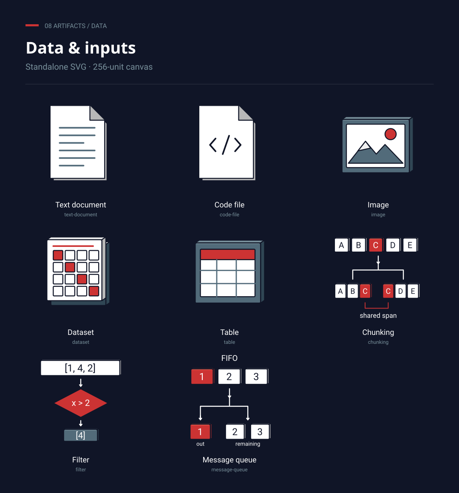
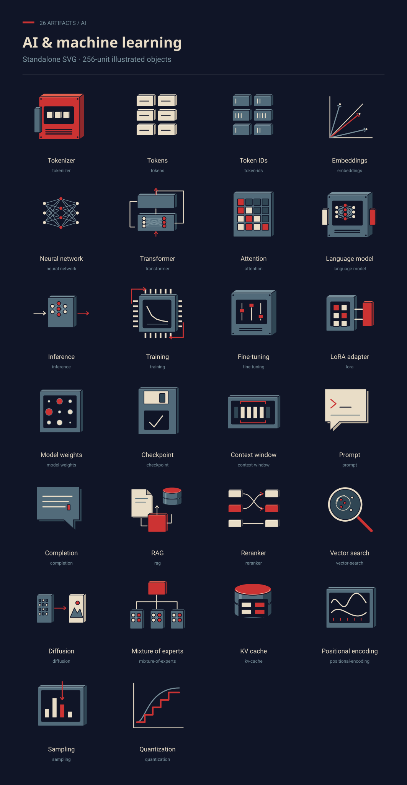
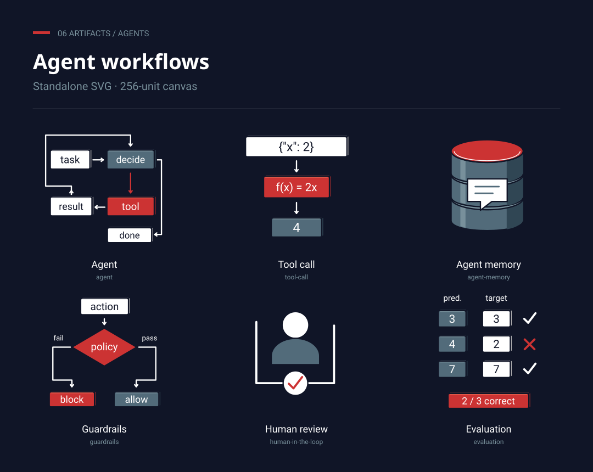
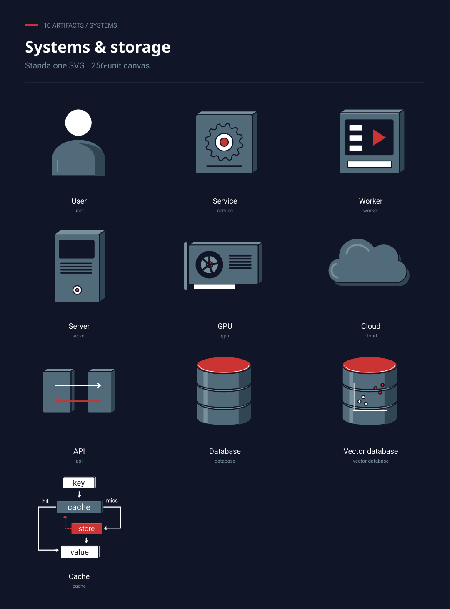
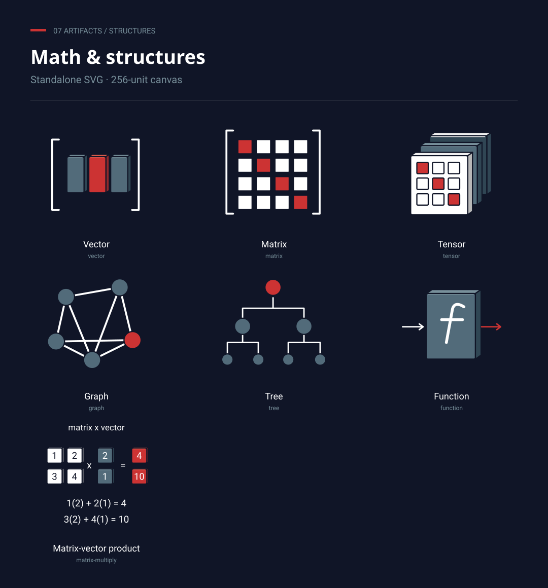

# Icons

46 branded SVG graphics for technical article diagrams, in the AI for Software Engineers branding.

Core operations show what happens to the data: text becomes token IDs, attention combines values, and training updates weights. Browse the images below, then open a category folder to get the individual SVGs. Each graphic has a transparent 256 × 256 canvas. Use explanatory diagrams at 192px minimum, preferably 256px or larger; simple object icons work at 96px.

## Data & inputs

[SVG files](icons/data/)

## AI & models

[SVG files](icons/ai/)

## Agent workflows

[SVG files](icons/agents/)

## Systems & storage

[SVG files](icons/systems/)

## Math & structures

[SVG files](icons/structures/)

