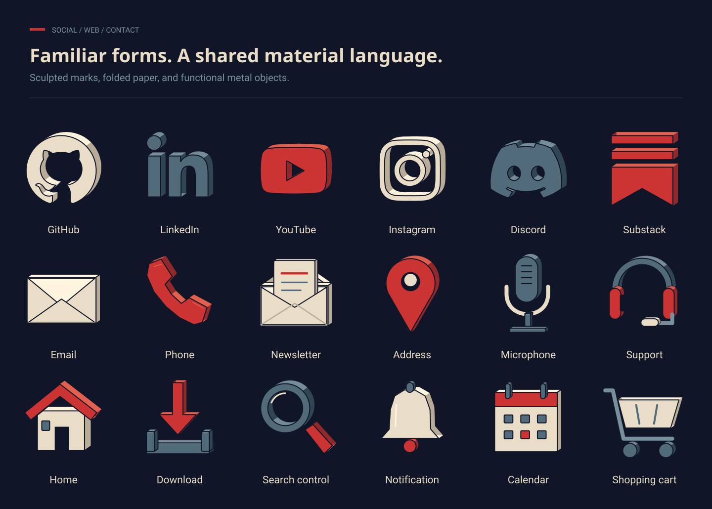

# Icons

**285 icon concepts for technical diagrams, websites, and AI for Software Engineers.**

Cel-shaded technical illustrations, sculpted social marks, and distinctive website and contact objects. Compact symbols and flowchart primitives are also included. **450 standalone SVG files across 17 category folders**, including alternate styles and light/dark tones.



## Start here

1. Open **[index.html](index.html)** in a browser. It works offline, directly from disk.
2. Search by concept, choose a style, and check the icon at your intended size.
3. **Download SVG**, or copy a file straight from its category folder.

No build, account, or package installation is required. The previewer is optional; the SVG files are the library.

```text
icons/
  ai/tokenizer.svg
  compute/gpu.svg
  data/chunking.svg
  socials/github.svg
  channels/email.svg
  interface/menu.svg
  flowchart/decision.svg
  …
variants/
  compact/compute/gpu.svg        # Simplified geometry, ink
  compact-ivory/compute/gpu.svg  # Same compact shape for dark surfaces
  brand/socials/github.svg      # Flat ink mark at 24 units
  ivory/socials/github.svg      # Flat ivory mark for dark surfaces
  ink/connectors/arrow-right.svg
```

## Choose a style

| Style | Concepts | Intended size | Treatment |
| --- | ---: | --- | --- |
| Illustrated | 280 | 64px for social/web/contact; 96px for technical objects | 256-unit canvas, hard cel shading, navy/ivory/steel/red |
| Compact | 53 | 32px for technical symbols; 24px for controls and primitives | Purpose-drawn 24-unit geometry, ink and ivory variants |
| Flat mark | 24 | 24px and larger | Source social silhouettes, ink and ivory variants |

Style counts overlap. All **24 social platforms, 48 website controls, and 15 contact icons** now have cel-shaded defaults in their category folders. Social marks have sculpted front/top/side planes; web and contact icons use distinct objects such as folded envelopes, handsets, lenses, bells, trays, and hardware controls.

The 1.2 update adds 60 concepts and redesigns the 27 previous social/web/contact defaults. Those canonical paths still exist, with 256-unit illustrated artwork replacing the earlier 24-unit symbols. Earlier compact and flat treatments remain available as explicit alternatives in the manifest. Twenty-six technical concepts also have compact renditions.

- [Complete icon index](docs/catalog.md) and [category inventory](docs/inventory.md).
- [Social/web/contact overview](docs/web-overview.svg), [technical overview](docs/overview.svg), [17 contact sheets](docs/contact-sheets/) and an [illustrated/compact comparison](docs/compact-comparison.svg).
- [Manifest](manifest.json) with stable IDs, aliases, paths, per-style dimensions, tones, and canvas anchors.
- [Usage guide](docs/usage.md), [design system](docs/design-system.md), and [contribution guide](CONTRIBUTING.md).

Social coverage includes GitHub, LinkedIn, YouTube, X, Bluesky, Facebook, Instagram, Threads, TikTok, Discord, Slack, Mastodon, Reddit, Twitch, Spotify, Medium, Pinterest, Telegram, WhatsApp, Stack Overflow, DEV Community, GitLab, Patreon, and Substack.

## Example diagrams

Each example is a self-contained 1600 × 900 SVG assembled from the library's geometry.

| Example | Explains |
| --- | --- |
| [Tokenization](examples/tokenization.svg) | Text → token pieces → vocabulary IDs → sequence |
| [RAG](examples/rag.svg) | Passage indexing and query-time retrieval/generation |
| [Service architecture](examples/service-architecture.svg) | Requests, durable data, and queued background work |
| [Delivery pipeline](examples/delivery-pipeline.svg) | Source → test → build → registry → deployment → service |

## Asset format

Every individual icon has a transparent square canvas, explicit colors, and native SVG shapes. There are **no raster images, fonts, filters, gradients, masks, external references, or scripts** in individual assets. Titles and descriptions provide nonvisual accessibility metadata.

Illustrated objects match the supplied deep-blue `#101527` reference. The previewer selects ink or ivory when that rendition has tone variants; illustrated object colors stay fixed. Compact geometry is drawn separately so it retains fewer, larger features at small sizes.

SVG structure and browser rendering are checked locally. An actual PowerPoint import has not been verified. Example diagrams contain live text with embedded fonts; individual icons have no font dependency.

## Maintain the library

Python 3.10+ and its standard library build, validate, and package the repository:

```sh
python3 scripts/build.py
python3 scripts/validate.py --rebuild
python3 scripts/package.py
```

The archive is `dist/icons.zip`. Generated files are included in the repository; consumers never need Python. See [CONTRIBUTING.md](CONTRIBUTING.md) for source locations and optional rendering/browser checks.

Twenty-three social silhouettes come from Font Awesome Free 7.3.1 under CC BY 4.0; Substack comes from Simple Icons 16.30.0 under CC0. Original front paths, attribution, provenance, and upstream licenses are retained. The illustrated versions add cel-shaded depth. Other drawings are original concept illustrations. See [third-party notices](THIRD_PARTY_NOTICES.md).
